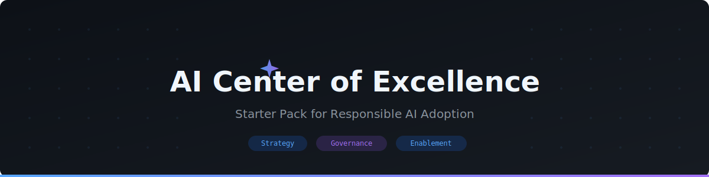

  

  

<h1 align="center">AI Center of Excellence (AICOE) Starter Pack</h1>

A starter pack to help you establish your AI Center of Excellence.

---

## A Letter on AI at Scale in the Enterprise

> *Before you dive into the pack, a word on why this work matters now.*

We are in the middle of the most consequential platform shift of our careers. Unlike previous waves of digital transformation—where we bolted technology onto existing processes—AI creates a genuine cognitive loop between people and systems. That changes how we conceptualize work itself.

**Enterprise AI is not one problem.** It is strategy, go-to-market, implementation, operations, and governance—all at once. Getting it right requires leaders who carry both technical credibility and the organizational instinct to know what actually moves a market and what it takes to run technology responsibly at scale. There is no "AI team" that solves this in isolation; it demands cross-functional leadership from development teams to the C-suite.

**The stakes are not about tooling.** They are about whether your organization continues to learn, build differentiated IP, and thrive in a world where AI models can absorb and commoditize expertise overnight. Every enterprise must now cultivate two forms of capital:

| | Human Capital | Token Capital |
|---|---|---|
| **What it is** | Knowledge, judgment, relationships, ingenuity, and pattern recognition of your people | The AI capability your organization builds, owns, and compounds over time |
| **Key insight** | Does *not* become less valuable as token capital grows—it becomes *more* valuable | Without human direction, compute runs in circles |

**The real opportunity is not picking the best model.** It is building a *learning loop* on top of models where human capital and token capital compound together. You can offload a task—even an entire job function—but you can never offload your learning. The future of your enterprise is the ability to compound that learning across people and AI.

**What this means architecturally:**

- Build agentic systems that improve with each use while you retain control of your IP.
- Develop private evals that measure whether AI is improving against *your* business outcomes—not generic benchmarks.
- Create reinforcement loops where models grow stronger on real traces from inside your organization.
- Make institutional memory queryable so every token spent is more efficient than the last.
- Ensure you can swap out any "generalist" model without losing the "company veteran" expertise your system has accumulated. That is the test of sovereignty.

**This loop becomes your new IP.** Think of it as a hill-climbing machine. Unlike most assets, it compounds—every improved workflow generates better training signal, which accelerates the accumulation of tacit knowledge unique to your firm. The companies that build this early will have an advantage that is extraordinarily hard to replicate, regardless of any single model breakthrough.

**Our north star should be a frontier *ecosystem*, not just a frontier model**—one where value flows broadly across every company, industry, and country. Where every organization owns the learning loop that encodes its institutional knowledge. Where platforms enable more value on top than is captured inside, and every company can continuously innovate and build value of its own.

When that happens, employees see their expertise amplified and their judgment become part of systems that make it replicable and scalable—and the benefits accrue to the companies and communities around them.

That is how we drive value for ourselves and the broader economy. And it is the stable equilibrium we should build together.

*— Welcome to the pack. Let's build.*

---

## Contents

| # | Document | Purpose |
|---|----------|---------|
| 1 | [AICOE Charter](./01-AICOE-Charter.md) | Template for purpose, scope, principles, governance, and operating model |
| 2 | [Resource Hub Index](./02-Resource-Hub-Index.md) | Categorized links to public resources and starter references |
| 3 | [Governance Checklist](./03-Governance-Checklist.md) | Template for responsible AI, privacy, security, approvals, and review |
| 4 | [Copilot Adoption Playbook](./04-Copilot-Adoption-Playbook.md) | Starter guide for rolling out GitHub Copilot in your organization |
| 5 | [Leadership Deck Outline](./05-Leadership-Deck-Outline.md) | Slide-by-slide outline for presenting your AICOE to leadership |

## How to Use

1. **Starting an AICOE?** Begin with the Charter, then use the Resource Hub to identify helpful references.
2. **Rolling out Copilot?** Use the Adoption Playbook to plan your rollout.
3. **Need governance sign-off?** Adapt and apply the Governance Checklist.
4. **Presenting to leadership?** Build your deck from the Leadership Deck Outline.

## Contributing

Customize these documents as your AICOE evolves. All materials are markdown for easy collaboration and version control.
