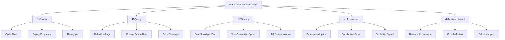
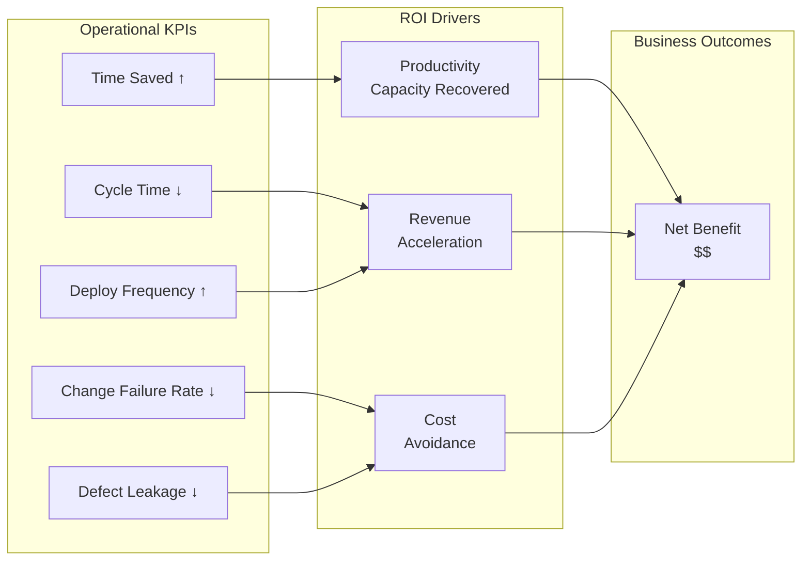
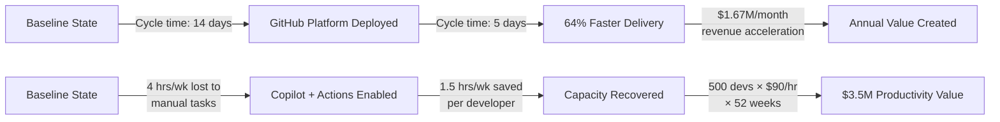

# ROI and Business Value

## Executive Summary

The business case for GitHub should combine four value streams:

1. **developer productivity gains**
2. **security risk reduction and cost avoidance**
3. **faster time-to-market**
4. **talent attraction, retention, and innovation capacity**

ROI is strongest when GitHub is positioned as a platform decision rather than a point-tool purchase.

## 1. Developer Productivity Gains

### What the Research Says

| Data Point | Interpretation | Source |
| --- | --- | --- |
| GitHub research found developers using Copilot completed a coding task **55% faster** | Strong evidence that AI assistance can compress task completion time | https://github.blog/news-insights/research/research-quantifying-github-copilots-impact-on-developer-productivity-and-happiness/ |
| In the same research, developers using Copilot completed the task in **1 hour 11 minutes** vs **2 hours 41 minutes** without it | Clear executive-ready narrative for time savings | Same as above |
| Multiple studies and customer pilots commonly report **20-55% productivity gains** depending on task type, team maturity, and measurement method | Good range for scenario planning | GitHub research + customer benchmark framing |
| GitHub Actions modernization programs and workflow standardization can produce **step-change CI improvements**, with some organizations reporting order-of-magnitude acceleration in specific pipelines | Use as upside case, not default assumption | GitHub Actions/customer references |

### ROI Formula

**Annual productivity value** = developers × loaded cost × % time saved × % of time recaptured for valuable work

### Example Productivity Scenarios

Assumptions:

- loaded developer cost: **$180,000/year**
- 100, 500, and 1,000 developer organizations
- effective recapture rate: **50%** of gross time savings becomes measurable business value

| Developers | 10% Gain | 20% Gain | 30% Gain |
| --- | ---: | ---: | ---: |
| 100 | $900,000 | $1.8M | $2.7M |
| 500 | $4.5M | $9.0M | $13.5M |
| 1,000 | $9.0M | $18.0M | $27.0M |

> Executive note: even conservative assumptions usually dwarf platform license cost.

## 2. CI/CD and Delivery Efficiency

Faster delivery creates both cost savings and revenue upside.

### Value Drivers

- shorter build and test times
- fewer manual deployment steps
- reusable workflows across teams
- reduced pipeline break/fix effort
- better visibility into delivery bottlenecks

### Example Value Model

If 500 developers each lose 10 minutes per day to inefficient CI/CD, that equals:

- 5,000 minutes/day
- about 83 hours/day
- about 18,260 hours/year (220 workdays)
- at $86.54/hour loaded cost, roughly **$1.58M/year** of engineering capacity

Even recovering a portion of that pays for a substantial platform investment.

## 3. Security Cost Avoidance

### Why It Matters

The ROI conversation should include avoided losses, not only productivity gains.

| Data Point | Business Relevance | Source |
| --- | --- | --- |
| IBM's *Cost of a Data Breach Report* continues to place average breach cost in the **multi-million-dollar** range globally | Security prevention economics materially matter at executive level | https://www.ibm.com/reports/data-breach |
| Earlier and more automated detection is cheaper than late-stage remediation | Shift-left security reduces rework, incident exposure, and audit strain | GitHub Advanced Security materials |
| Integrated secret scanning, code scanning, and dependency review reduce the chance that known issues reach production | Embedded controls lower operational and governance cost | https://github.com/security/advanced-security |

### Avoidance Model

**Expected annual loss reduction** = baseline security incident probability × baseline loss severity × reduction percentage

Example:

- annual probability of a serious software security event: **8%**
- expected event cost: **$4.5M**
- GitHub-driven reduction in probability/severity: **20%**

Expected annual benefit:

0.08 × $4.5M × 20% = **$72,000/year**

That is a deliberately conservative example. In highly regulated or customer-facing environments, the expected value can be much larger.

## 4. Time-to-Market Acceleration

Time-to-market value is often the largest benefit, but the hardest to model. Use operational proxies.

### Suggested Metrics

| Metric | Why Leaders Care |
| --- | --- |
| Lead time for changes | Speed from idea to production |
| Deployment frequency | Organizational delivery capacity |
| Change failure rate | Ability to move fast safely |
| Mean time to recovery | Operational resilience |
| Time to onboard new engineers | Talent productivity ramp |

### Example Calculation

If a product team shipping $20M/year in revenue brings a release forward by one month, the acceleration value may be roughly:

- $20M / 12 = **$1.67M** in revenue timing benefit

Not all of that is incremental profit, but it is strategically meaningful when applied across multiple products.

## 5. KPI Measurement Framework

Use this five-pillar model to build a comprehensive measurement story that connects engineering metrics to business outcomes.

### Pillar 1: Velocity — Are we faster?

| KPI | Definition | Target Signal |
| --- | --- | --- |
| Deployment Frequency | How often code is released to production | ↑ Weekly or daily deploys |
| Lead Time for Changes | Time from commit to running in production | ↓ Hours, not weeks |
| Cycle Time | End-to-end time from first commit to production | ↓ Shorter iteration loops |
| Throughput | PRs merged per developer per sprint | ↑ Sustained output |

### Pillar 2: Quality — Are we safe?

| KPI | Definition | Target Signal |
| --- | --- | --- |
| Change Failure Rate | % of deployments causing a production issue | ↓ Below 15% |
| Defect Leakage | Bugs found in production vs. those caught in staging/testing | ↓ Shift left catches more |
| Code Coverage | % of codebase executed during automated testing | ↑ Above 80% on critical paths |
| Rework Rate | % of PRs requiring post-merge fixes | ↓ First-time quality |

### Pillar 3: Efficiency — Are we more productive?

| KPI | Definition | Target Signal |
| --- | --- | --- |
| Developer Time Saved | Hours recovered per developer per week | ↑ 1.5–4 hrs/week |
| Task Completion Speed | Time to complete common work items | ↓ 20–55% faster |
| PR & Code Review Volume | Count of pull requests opened, reviewed, merged | ↑ Higher throughput, lower wait |
| Automation Rate | % of CI/CD steps that are fully automated | ↑ Fewer manual gates |

### Pillar 4: Experience — Will this scale?

| KPI | Definition | Target Signal |
| --- | --- | --- |
| Adoption Rate | % of licensed developers actively using the platform weekly | ↑ Above 75% |
| Developer Satisfaction | NPS or survey-based sentiment score | ↑ Quarter-over-quarter |
| Onboarding Ramp Time | Time for new hires to ship first meaningful PR | ↓ Weeks, not months |
| Tool Consolidation | Number of redundant tools retired | ↑ Platform convergence |

### Pillar 5: Business Impact — Does it matter?

| KPI | Definition | Target Signal |
| --- | --- | --- |
| Revenue Acceleration | Value of features shipped earlier due to faster delivery | ↑ Measurable $ impact |
| Cost Reduction | Savings from tool consolidation, fewer incidents, less rework | ↑ Hard dollar savings |
| Delivery Predictability | % of commitments met on time | ↑ Reliable planning |
| Competitive Advantage | Speed to market vs. industry peers | ↑ Market differentiation |

### KPI-to-ROI Mapping

Use this to connect operational metrics to dollar outcomes in executive conversations:

### ROI Waterfall: From Metrics to Value

### Measurement Cadence

| Cadence | What to Measure | Who Cares |
| --- | --- | --- |
| Weekly | Active users, deploy frequency, PR volume | Engineering managers |
| Monthly | Cycle time trends, satisfaction scores, defect leakage | Directors, VPs |
| Quarterly | ROI calculations, cost avoidance, revenue impact | C-suite, Finance |

### Example Executive KPI Dashboard Narrative

> After 90 days on GitHub Enterprise, the platform engineering team observed:
> - **Deployment frequency** increased from bi-weekly to 3x/week (+500%)
> - **Lead time for changes** dropped from 12 days to 4 days (−67%)
> - **Change failure rate** decreased from 22% to 9% (−59%)
> - **Developer satisfaction** rose from 3.1 to 4.3 on a 5-point scale
> - **Estimated annual productivity value**: $4.2M across 500 developers
>
> These improvements translate to roughly **$6.8M** in combined value against a **$1.1M** annual platform investment — a **6.2x ROI**.

## 6. Talent Attraction and Retention

Modern developer tooling is now part of the employee value proposition.

### Talent Economics

Replacing an engineer can cost meaningfully more than salary once recruiting, ramp-up, lost context, and productivity dip are included. GitHub contributes by:

- aligning with tools many developers already use
- reducing frustration in daily workflows
- supporting modern AI-assisted engineering practices
- strengthening employer brand during hiring

### Practical Leadership Lens

If better tooling helps retain even **5 senior engineers** whose replacement/ramp cost is **$50,000** each, that is **$250,000** in avoided churn cost before considering project disruption.

## 7. Innovation Metrics

GitHub's value is not just efficiency; it also increases the organization's ability to experiment.

### Metrics to Track

| Innovation Metric | Example Signal |
| --- | --- |
| Experiment throughput | More prototypes or proofs of concept per quarter |
| Reuse rate | Shared actions, templates, starter repos, and InnerSource contributions |
| AI adoption rate | Percentage of developers actively using Copilot or AI-enabled workflows |
| Security remediation velocity | Faster mean time to remediate code and dependency issues |
| Cross-team collaboration | Increased contribution across business-unit boundaries |

## Sample ROI Summary by Organization Size

Assumptions:

- conservative productivity gain: **10%**
- recapture rate: **50%**
- modest CI/CD recovery and talent savings included
- excludes large revenue acceleration upside

| Developers | Productivity Value | CI/CD Value | Talent/Retention Value | Security Avoidance | Total Illustrative Annual Value |
| --- | ---: | ---: | ---: | ---: | ---: |
| 100 | $900,000 | $250,000 | $75,000 | $50,000 | **$1.28M** |
| 500 | $4.5M | $1.58M | $250,000 | $150,000 | **$6.48M** |
| 1,000 | $9.0M | $3.1M | $500,000 | $300,000 | **$12.9M** |

## Business Case Narrative for Leadership

### The Most Effective Executive Story

- **Cost**: GitHub can consolidate tooling and reduce delivery friction.
- **Productivity**: AI-assisted development and workflow automation recover engineering capacity.
- **Risk**: Built-in security helps shift detection left and reduce exposure.
- **Growth**: Faster software delivery improves competitiveness and innovation.
- **Talent**: Better tooling strengthens retention and hiring posture.

## Reference Links

- GitHub Copilot productivity research: https://github.blog/news-insights/research/research-quantifying-github-copilots-impact-on-developer-productivity-and-happiness/
- GitHub Actions / CI/CD: https://github.com/solutions/use-case/ci-cd
- GitHub Advanced Security: https://github.com/security/advanced-security
- IBM Cost of a Data Breach: https://www.ibm.com/reports/data-breach
